Artists and entertainers often make use of multiple sensory outlets that closely interplay to effectively communicate their ideas. For example, in lyrical compositions, lyrics and melody are both essential components that express the musician’s emotions or experiences. A popular trend on YouTube is to generate compositions of music based on the lyrics from popular songs \[1\]. We know from this that some genres of music are relatively predictable in their mood/melody. We want to understand how these components interact to make meaningful music that audiences love and relate to.

# Methods

## Data Collection and Processing

We want our final model to accept lyrics of an unknown song and produce a list of known songs that it predicts will sound the most similar. We could use Natural Language Processing (NLP) techniques and the nltk Python package to analyze the lyrics of songs and correlate them to other features of the songs, such as genre and publication year \[2\]. The Million Song Dataset \[3\] (MSD) contains metadata for one million popular songs, of which over 200,000 come with bag-of-words stemmed lyrics. Intact lyrics can be found by scraping the net if bag-of-words is insufficient.

We used the genre tags, loudness, tempo, and year of release metadata as the target features. The goal is to predict the features of a song using only its lyrics, attempting to determine if there is a correlation between the lyrics and each target feature, as well as which sections of the lyrics are the most important in comparing and contrasting the songs. Validation will be done using songs from the dataset that were not used to train the model.

## Features, Models, and Performance Measures

- Tempo
- Loudness
- Release Decade
- Genre

The project is broken into classifying each of these 4 categories. For all of our categories, we run PCA to determine the most important features that contribute to the intended features. We also plotted graphs to visualize variance and the retained variance after applying PCA.

For each individual category, different methods were applied to produce the best result. We are using logistic, lasso, and linear regressions, which we eventually convert to a classification. On the classifications side, we have used SVM's, Naive Bayes, and Random Forest.

# PCA Analysis

### First two principal components with Tempo Label

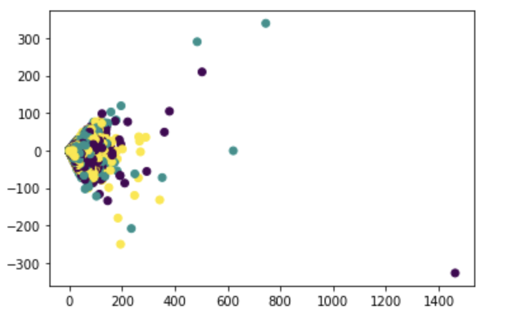

### First two principal components with Loudness Label

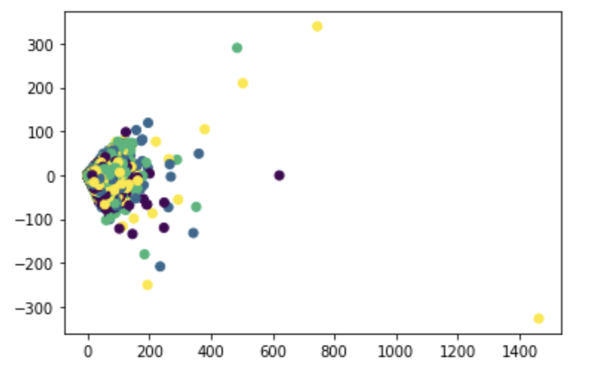

### First two principal components with Year Label

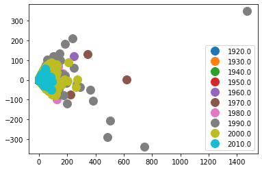

### Varianced captured by first twenty components = 49.64%

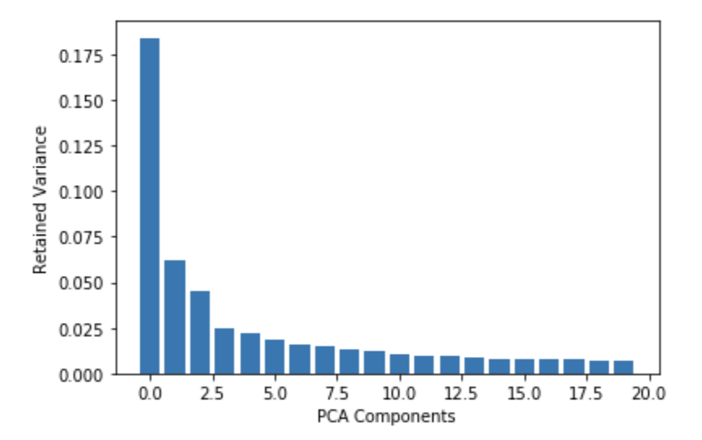

Varianced captured by first 600 components = 89.8485%

As we have 5000 features in total, variance can't be easily captured by principal components. The first principal component only captures 18.41% variance, and we will use PCA in *Year* analysis later on. However, this intial analysis reveals that our models may have a hard time capturing our features with this bag-of-words data since the first 3 components only recover about 25% of the variance. 

# Classification

## Predicting Tempo

#### Description of Tempo data

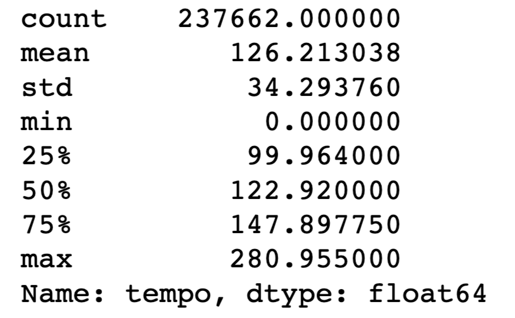

The min value of tempo is 0, which means that there exists some invalid records without Tempo label. So we dropped those rows by changing 0 to NAN and use dropna function in pandas, thus easily removing those rows. In total 266 tracks without tempo information were dropped, and we did the same thing on Loudness and Year.

#### Description of Tempo data after removing invalid rows

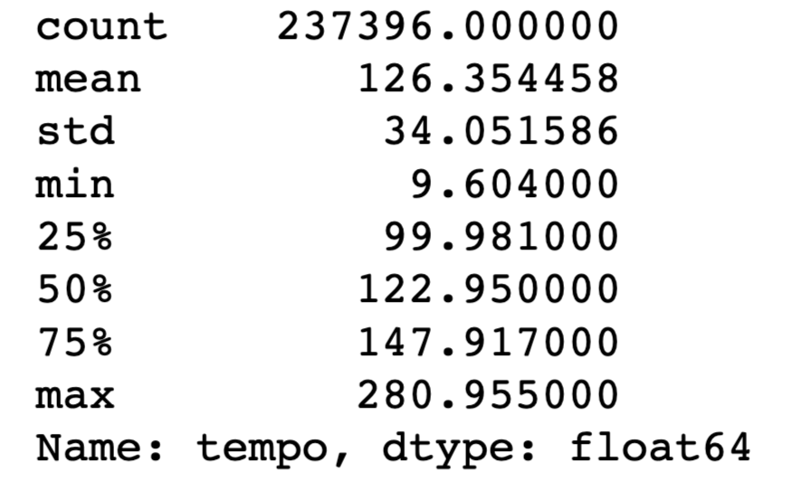

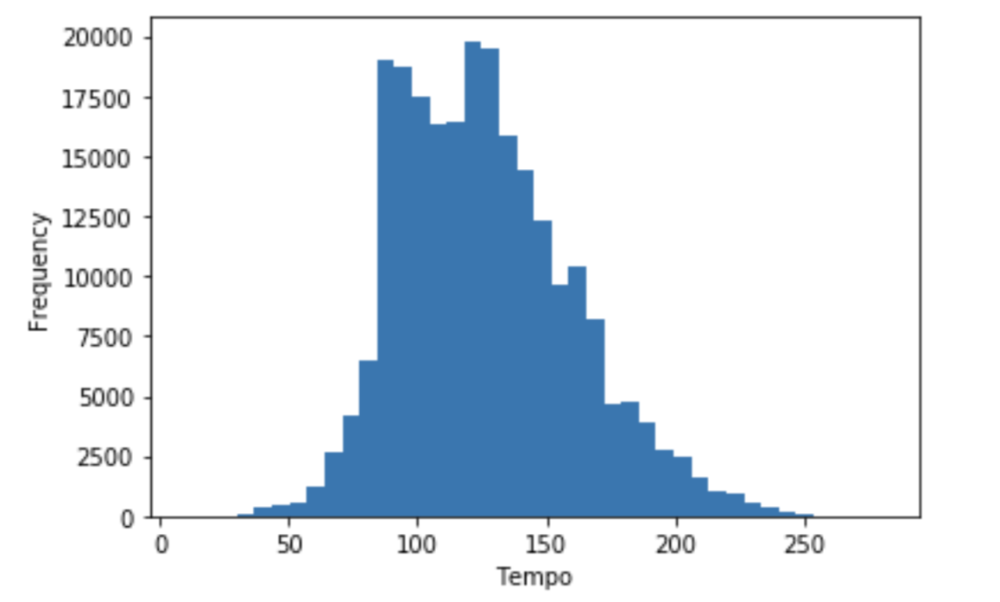

We classify tempo into two groups by mean value in to two classes. And we also classify tempo into three groups, high tempo for songs with tempo not less than 138, low tempo for songs with tempo less than 108, and middle tempo otherwise, so that each group will have a similar proportion of data ~33%.

#### Training on original data:

Two classes:

| Method               | Test Accuracy     |
| :------------------- | :---------------- |
| Linear Regression    | 0.537621469853598 |
| Lasso Regression     | 0.537621469853598 |
| Gaussion Naive Bayes | 0.505317414400673 |
| Random Forest-2      | 0.539937446528001 |

Three classes:

| Method               | Train Accuracy     | Test Accuracy      |
| :------------------- | :----------------- | :----------------- |
| Linear Regression    | 0.3348176943861063 | 0.3353880284755473 |
| Logistic Regression  | 0.4399164746023818 | 0.3735379603757424 |
| Gaussion Naive Bayes | 0.3879899143684144 | 0.3538241199679861 |
| Random Forest-5      | 0.3843371826426039 | 0.3758547578595599 |

For two classes splited by medium value, the expected accuracy of random guess should be 50% and for three classes, the expected accuracy of random guess would be 33.3%. However, our model only gives a slightly higher result. Compared to loudness and year, who’s models gain a significant increase of accuracy compared to random guessing, tempo is harder to predict. As a result, bags of words give us less information for tempo compared to years and loudness .

## Predicting Loudness

#### Description of Tempo data

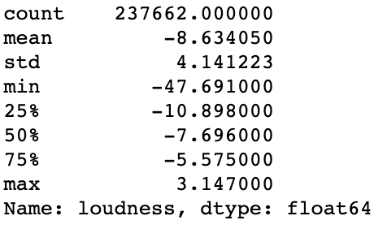

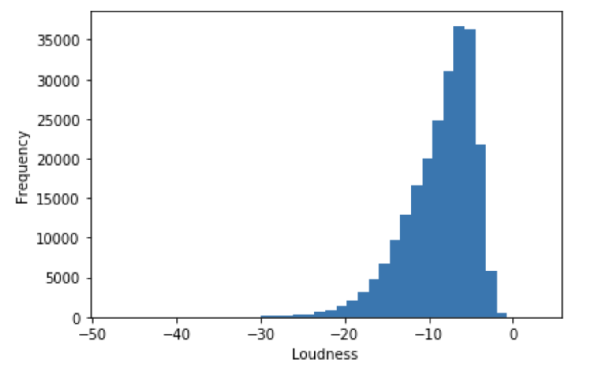

We classify Loudness according to 25%, 50%, 75% threshold got here. So it becomes a classification problem, and there will be 4 classes in total. Accuracy is calculated by the percentage of correct prediction of test data. Number of train data and test data is 7:3, obtained by train_test_split function provided in sklearn. Since loudness is classified into 4 classes with the same size, the expected accuracy of random guessing should be 25%.

### Training on original data: 5000 features

| Method               | Train Accuracy     | Test Accuracy      |
| :------------------- | :----------------- | :----------------- |
| Linear Regression    | 0.1734148252285003 | 0.1113735210312987 |
| Lasso Reggression    | 0.1711473933937229 | 0.1207579718933326 |
| Gaussion Naive Bayes | 0.3431953018399524 | 0.3139735480161012 |
| Random Forest-5      | 0.3432313675516791 | 0.3332164546487328 |

Accuracy of regression is obtained by classifying regression results and comparing them to ground truth. Apparently, regression doesn't work for loudness. Among all these classifiers, random forest gives us a pretty high accuracy, relatively short running time, and the feature_importances_ attribute of random forest classifier gives us an easy way to get words that are considered to be most important, so we will try to explore more out of it.

### Reduce feature, only use 21-2000th words

Using all 5000 words, top ten important features are: i, it, this, fuck, shit, not, what, hate, we, death. We notice that there are some common words like i, it, we, this, and also some words that contain intensive emotion such as fuck, shit, hate, death. Since we are not interested in those common words which are listed at the beginning of the word list, we eliminate the first 20 common words. Moreover, from the  feature_importances_ attribute, we found out that the last several thousand words have almost 0 importance, so we try to only use words 21-2000 to see the effect.

| Method               | Train Accuracy     | Test Accuracy      |
| :------------------- | :----------------- | :----------------- |
| Decision Tree.       | 0.4582148674885641 | 0.3170451198474032 |
| Gaussion Naive Bayes | 0.3430209842332730 | 0.3141138024376218 |
| Neural Network       | 0.4020725762338981 | 0.1207579718933326 |
| Random Forest-5      | 0.3482084357699729 | 0.3382515883813237 |

Neural Network is a complex model and can easily overfit the data. Although the train accuracy is 40.3%, test accuracy is only 12.1%. In contrust, Random Forest takes much less time and gives pretty good result.

### For random forest with depth 5:

Top twenty important words: this, blood, fuck, love, shit, hate, yeah, life, wanna, blue, death, breath, lie, what, hell, burn, control, ca, pain, fight

Compared to using all 5000 words, accuracy for both train data and test data are increased!

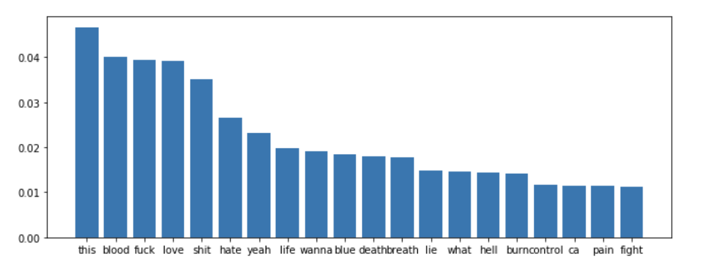

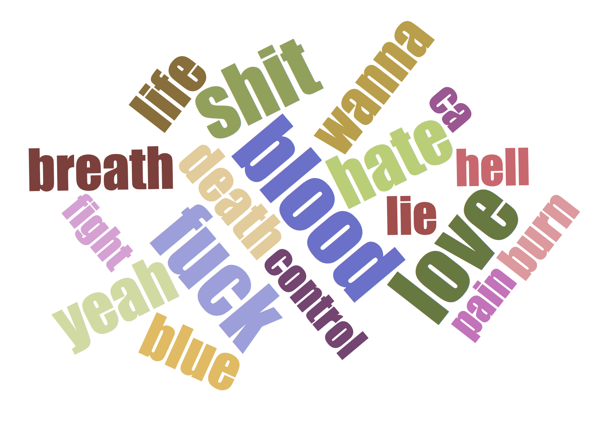

(Common words like “this”, “what” are already excluded by online word visualizer)

We can see many words related to anger and negative emotions here, which makes pretty sense since we are predicting loudness, and loud music is a way to vent negative feelings.

### Hyperparameter Analization

To get the best max_depth hyperparameter for the Random Forest model, we use 21-5000 words and run on max_depth varying from 3 to 60.

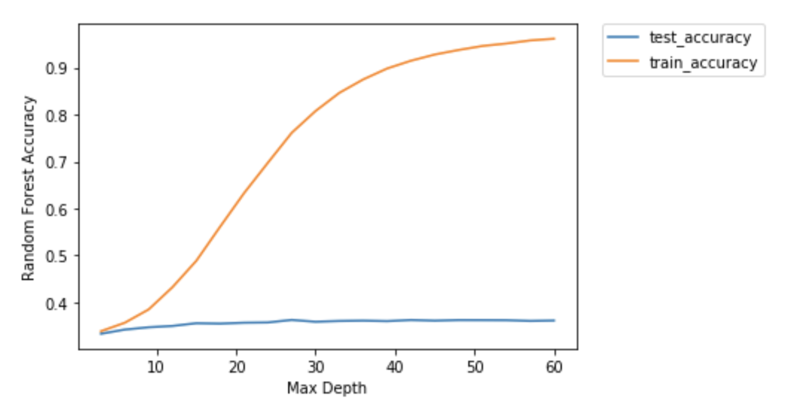

There is obvious huge overfitting for large max_depth. Max_depth of 60 can get an almost perfect prediction on training set, however, test score is still below 40%.

A closer look for max_depth till 18:

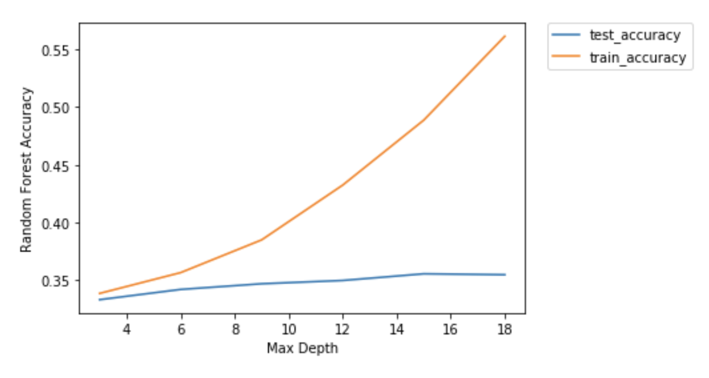

Though training accuracy increases dramatically for deeper random forest, testing accuracy does not improve a lot. A max_depth of 5-10 is appropriate and time saving.

### 2D visualization for process of training

Only use “love” and “fuck” two features to visulize training of random forest, dimention is reduced from 5000 to 2.

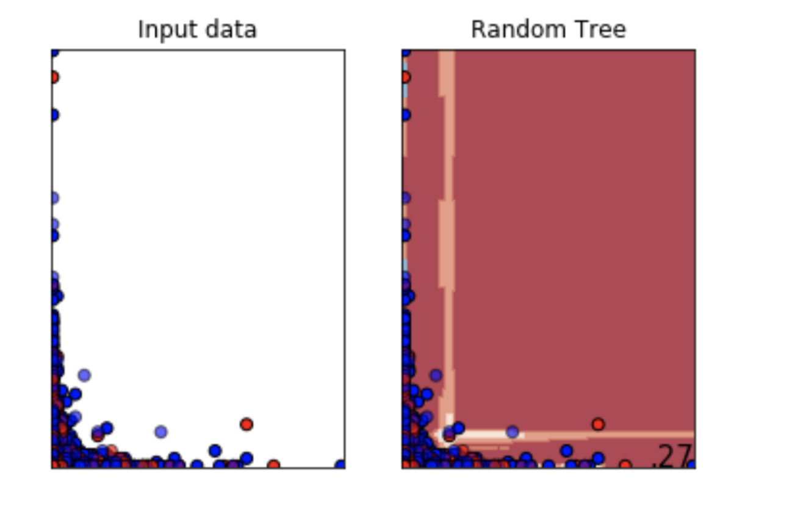

Since originally there are 5000 words, whereas we are only using two important features determined by random forest, so accuracy is only 27% here. But it is already 2% improvement compared to random guessing, which means these two words do give us considerable information.

### Normalization

We want to find out whether normalization would be helpful to accuracy. Since different tracks have different numbers of words and different words have different frequencies among all songs, we try normalization by row and by column to eliminate these two effects respectively. Random forest on 21-5000th words is used here.

| Random Forest-5       | Train Accuracy     | Test Accuracy      |
| :-------------------- | :----------------- | :----------------- |
| Normalization by row  | 0.3545586513040246 | 0.3414611055593541 |
| Normalization by col  | 0.3508629213798326 | 0.3402303686951033 |
| Without Normalization | 0.3481242824426104 | 0.3380692576333469 |

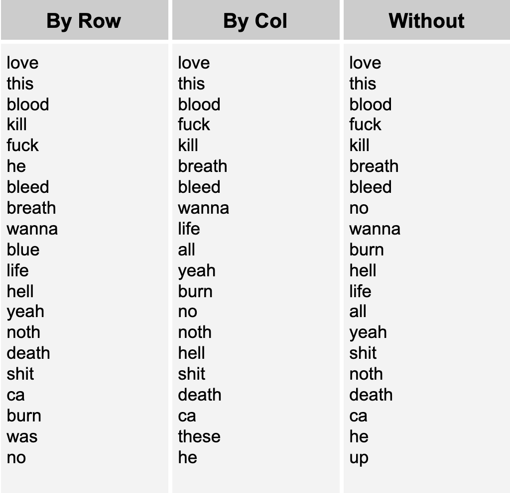

After normalization by row and column, accuracy for both training set and test set are increased by 1%, while important features are very similar. We can say that, normalization doesn't change the model a lot but accuracy is indeed slightly increased.

## Predicting Year

Since we were only looking to see if it was possible to predict the decade the song the lyrics were from was released, we used a binary method of determining accuracy: either it is within range, or not. We did this two ways:

1. Is the predicted year in the same decade
2. Is the predicted year within 5 years of the actual release date

We processed the lyrics in a similar fashion as described in the Data Cleaning Section for Loudness, but this time using the 'year' feature in the dataset to get the samples of interest. 

Here is the distribution of the years. The minimum year was 1920 and the maximum year was 2010. The majority of songs left after processing used were released after 1990. This may present an issue if the models end up simply guessing within this range.  

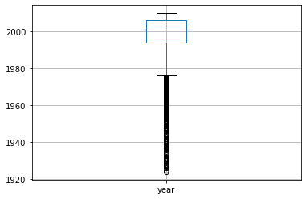

### Regression

Along with comparing multiple models, we additionally compared the accuracies of using PCA and the raw lyrics data for the Regression Models

| Data              | test/train  | Decade             | Window             |
| :-----------------| :-----------| :------------------| :----------------- |
| PCA               | Linear Reg. | 0.2681/0.2682      | 0.3589/0.3588      |
| PCA               | Ridge Reg.  | 0.2681/0.2682      | 0.3589/0.3588      |
| PCA               | Lasso Reg.  | 0.2671/0.2671      | 0.3585/0.3586      |
| Raw               | Linear Reg. | 0.3968/0.4149      | 0.4237/0.4361      |
| Raw               | Ridge Reg.  | 0.3968/0.4138      | 0.4237/0.4361      |
| Raw               | Lasso Reg.  | 0.3236/0.3274      | 0.3878/0.3873      |

In all cases, the training and testing accuracies were relatively close, so there were not any apparent signs of overfitting. We can see that Linear and Ridge regression perform similarly, while lasso tends to do worse. Additionally, using PCA is able to recover about 60% of the accruacy of just using the raw bag-of-words data for training. 

We determined the “important” words based on the magnitude of it’s feature coefficient derived from each of the models. One can interpret the weights for each word as an indication of whether that word is associated more with “older” music released in earlier decades, or with more recent decades. If its coefficient is negative, then that word decreases the predicted year, and vise versa. This is also so we can compare regressions' results to Random Forest. 

Below, we only report the top words associated with the coefficients with the largest magnitudes from using the raw data and using the window accuracy measurement. We also only compare Linear and Lasso, since Linear and Ridge Regression returned very similar results. The words are listed in decreasing order of the magnitude of its associated coefficients. The (+) refers to the positive coffecients, and the (-) are the negative coffecients. This means the first words in each list is the most "positive" or the most "negative."

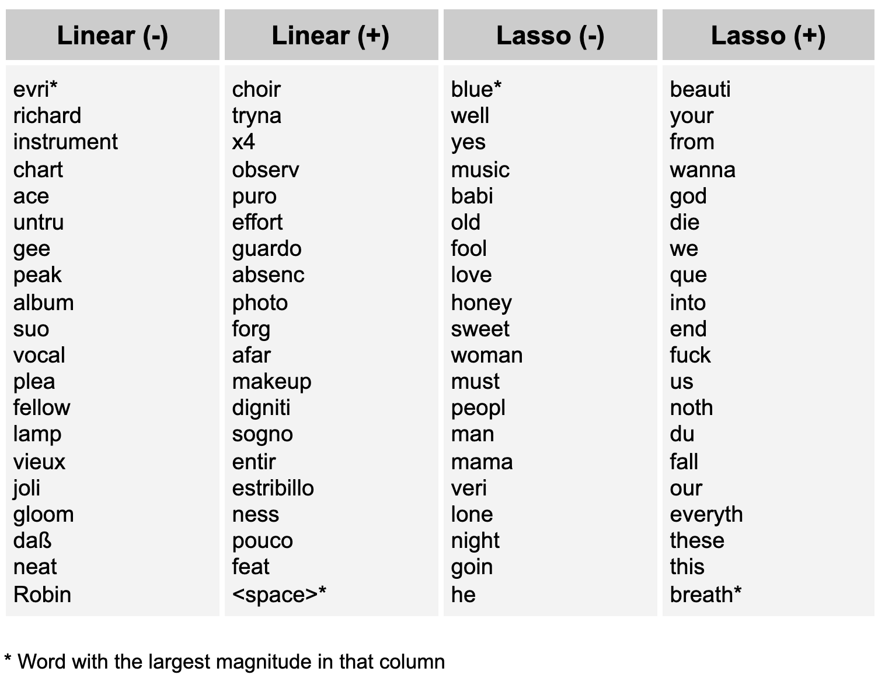

Some of these words we could imagine to be associated with older songs such as "fellow" and "lone" from the (-) coefficient columns, and words like "tryna", "wanna", and "fuck" can be associated with more recent phenomena of modern lyrical characteristics. 

However, the other words are foreign (primarly Spanish) that our team does not have the insight for, and more common words like "this", "we", and "these" that we do not have an explaination for. There are also still errors in the data cleaning step to recognize typos in the words ('peopl'), and words that are not part of the words in the lyrics, but the structure of the song (like 'x4').

### Random Forest

Based on the results from Loudness and Tempo, we decided to also try Random Forest using the raw input lyrics. We also ignored the top 20 most frequent words in the corpus for training and testing. 

Similar to above, we tested several parameters for Random Forest to see which gave the best results. Below is a graph of the results.

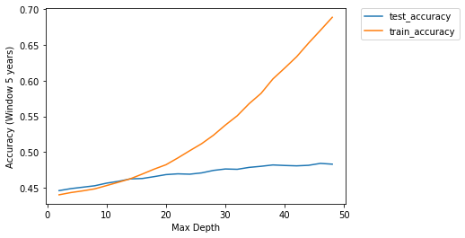

We plot the training and testing window-accuracy for multiple maximum depths of the Random Forests. The two start to diverge around a depth of 14. After this, while the training accuracy increases minimally, there is still a degree of of overfitting as the training accuracy reaches over 70% accuracy, but the testing accuracy hovers around 47%. However, this testing accuracy is significantly better than linear regression.

We looked at the most important words for the Random Forest with a maximum depth of 14. 

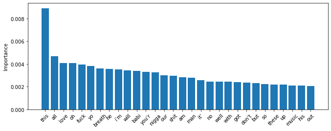

The words above are the most informative (in decreasing order). Words such as “fuck”, “yo”, and “nigga” could be attributed to lyrics from rap songs that are a more recent phenomenon.

What is also interesting is that Lasso regression returned some of the same words as this random forest, but did not return as good of an (window-based) accuracy compared to the other regression models. This may indicate that a linear model is not as accurate of a model for language as a decision tree. Decision trees categorizes, while a linear model suggests a continuity or correlation with words and time. However, some words come in and out of use in music, and so a linear model, which assigns a fixed weight to each word, does not necessarily reflect this possibility. A decision tree however could model better groupings of words that are indicitive of a particlar era or time. 

Overall, these models still did not do a great job of predicting the release years within a 5 year margin. Since the majority of the data falls in a 20 year window, we would expect weighted random guessing to be within ~50% window-accuracy. Additionally, these models are only trained on music released between 1920-2010, so it has an inherent limitation on it's predictive ability. We would need much more complicated models and more information to extrapolate lyrics that are released outside of this range. 

## Predicting Genre
The initial slice of the data used for the genre category required significant cleaning. There were thousands of tags, the vast majority of which were nonsense. After filtering out most of the tags, the following 11 were used:

'alternative', 'classic rock', 'dance', 'electronic', 'folk', 'hard rock', 'indie', 'indie rock', 'metal', 'pop', 'punk'

The following figure displays the frequency of each tag in the filtered dataset.

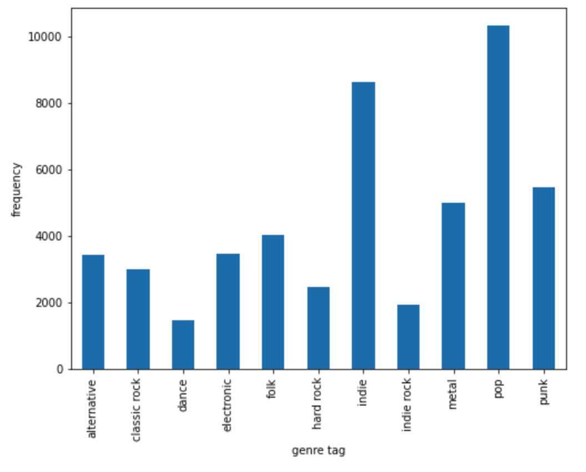

This left us with 49327 entries to train the model with. The dataframe was structured such that each song was represented by two columns of information, the target tag and a ‘lyrics_vector’ encoding the frequency of each word in a list, where every list was the same length, and each index represented the same word. I.e. if the 7th index had a value of 9, there were 9 occurrences of that word.

Next, each entry in the lyrics vector was converted into an integer by multiplying its index by 100 and adding its frequency to encode both pieces of information into a number without needing to preserve the order in which they appeared. This was done so that the top n words could be taken and split into n columns.

We attempted to engineer other features into the dataframe with limited success. These attempts included information/actions such as number of words in a song, number of unique words in a song, zeroing out a few words per entry (to see if it would reduce overfitting), and reordering the words to put the most frequent ones first.

Unfortunately, it appears that the frequency of words is not enough to accurately determine the genre of a song. Our best attempts wouldn’t go above 30% accuracy, and training for longer would immediately cause the model to overfit. This is probably due to a combination of the model being confused by stop words and by gibberish words, both of which introduced noise.

This suggests that determining the genre would require the information contained in the order of the words or perhaps even the notes of the song.

The following figure shows accuracy results for various models in the sklearn package. The three best models, in order, were random forest, xgboost, and logistic regression.

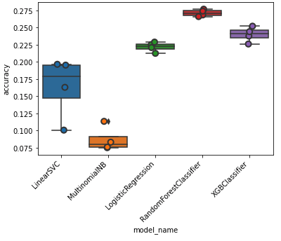

We also used fast.ai, a deep learning library built over pytorch. The main advantage of the library is that it uses pretrained models to bootstrap the training process in a fraction of the usual time. This meant training times in the ballpark of 10-30 seconds total, allowing for faster experimentation with hyperparameters and feature engineering.

The results ranged from similar to slightly better with accuracy around 26-30%. The following is a confusion matrix showing one training and validation cycle of the model.

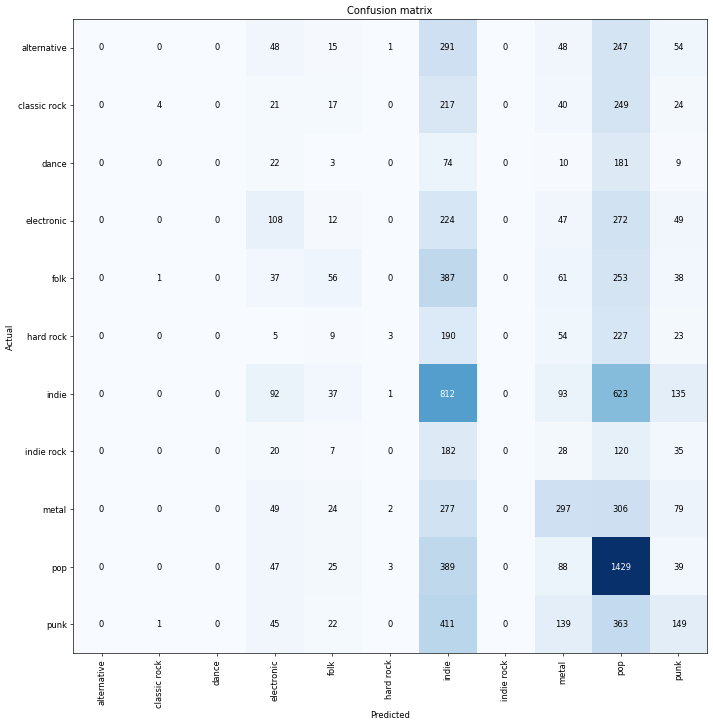

The model shows a clear bias towards predicting indie or pop. It is almost certainly because those are the two most frequently occurring tags in the dataset. Investigating this bias could potentially lead to better results.

# Discussion

The results across categories were quite mixed. We suspect this is directly related to the kind of information contained in the words of a song. For example, the results for loudness and year were better relative to random guessing than for tempo and genre.

However, we believe there is an upper limit to the amount of information that can be gained from the bag-of-words stemmed lyrics provided in the dataset. As seen in our PCA plots, our data has limited predictable structure or clustering of the features of interest. As other research has shown, hand-picked features and feature engineering are necessary in the early steps of the process when not using deep learning [4]. Additionally, by keeping the lyrics intact, newer methods such as hierarchical attention networks (HAN) can gain insight into the structure of the song, and how the words form lines, lines form stanzas, and so on [4]. Since the provided dataset could not provide the original intact lyrics due to copyright laws, and also stemmed the words before creating the bag of words, it was difficult for us to use deep learning or natural language processing methods with this dataset.

Clearly, these results show there are some major improvements we can make. Our existing approach primarily ignores grammatical structure, lyrical structure (such as stanzas), and other features we can garner from the lyrics. Despite the pitfalls, we can still get some information from the words of lyrics to estimate characteristics of the music that can accompany them, even with something as rudimentary as bag-of-words and simple regression and classification techniques. It is not surprising that an artist’s word choices align with the music, but this project has allowed us to see numerically how the two interact. Further exploration into this question will hopefully lead us to better understand what makes compelling music, and gain more insight into artists’ intuitions behind their work. 

# Future Work

As part of this research, we made some considerations as how to further study the relationship between lyrics and song features given more time, which include the following.
1. Using logistic regression on other features in the dataset.

   Logistic regression was one of the more successful models that worked with our data, both in our own research and in some of the references listed below. We believe that it would be a good stepping stone to exploring the relationship between the bag-of-words lyrics and other musical features.

2. Include additional secondary features.

   While the dataset provided the bag-of-words lyrics, it may have been more useful to the models to have some more consolidated information, such as the total number of words in the song, number of unique words, and other such features. With this aggregate information, it is possible that the models would get better results by focusing less on the individual words and more on the overall lyrics as a whole.

3. Normalizing the data.

   While we did normalize some of the data during our research, we did not do it consistently among the target features we were exploring (e.g. loudness, tempo, and year). Part of this has to do with the fact that each of these target features used different subsets of data; some songs did not have a year associated with it, so there were fewer songs used in training that model compared to the tempo model.

   Given more time, we could have done some of this normalization as part of the data pre-processing and cleanup phase so that the lyrics features provided to the different models would be the identical.

4. Using unaltered lyrics with original structure intact.

   While our exploration did give some interesting results, we were not able to get a significant accuracy on some features, especially when trying to predict genre tags. As some of the references below have mentioned, there was a ceiling on the genre prediction accuracy when using just bag-of-words lyrics. Additionally, the bag-of-words lyrics provided by the dataset combined the stemmed words together. This means words like "cry", "cries", "cried", and "crying" were all considered to be the same word. This prevented us from also gaining information about the parts of speech of the words in the lyrics.

   However, the references below mention that they were able to break through that ceiling when using the songs' original lyrics in order, since the deep learning methods could gain information from the parts of speech and structure of the words' appearances in the lyrics. Given more time and the full lyrics in the dataset, we definitely want to explore this avenue for predicting these same features using the intact lyrics.

5. Training time and data availability

   Simply put, if we had more time and more data, we would try this project again. Apart from the features mentioned above, one feature we wish was provided was the song language(s). We wanted to start by only using English songs before expanding out to all songs in the dataset. However, there was no easy way to tell which songs in the dataset were strictly in English (especially since many foreign songs contain verses in multiple languages, such as English and Spanish). Given the time constraints on this project, we think we could have gotten some more compelling results if we could focus on one language at a time, especially since natural language processing was one of the key concepts we wanted to explore when training our predictive models.

# References

1. Schneider, K. H. [KurtHugoSchneider]. (2019, July 9). “Remaking SEÑORITA Without Ever Hearing It.” https://www.youtube.com/watch?v=zhh8At3xN6k
1. Fell, Michael, and Caroline Sporleder. “Lyrics-based analysis and classification of music.” Proceedings of COLING 2014, the 25th International Conference on Computational Linguistics: Technical Papers. 2014.
1. Thierry Bertin-Mahieux, Daniel P.W. Ellis, Brian Whitman, and Paul Lamere. The Million Song Dataset. In Proceedings of the 12th International Society for Music Information Retrieval Conference (ISMIR 2011), 2011.
1. Tsaptsinos, Alexandros. “Lyrics-based music genre classification using a hierarchical attention network.” arXiv:1707.04678 (2017).

# Contributions

- **Claudia Chu** Year, Github page
- **Murtaza Husain** FastAI, Genre, Presentation
- **Enoch Kumala** Genre, Github page
- **Suraj Masand** Data collection, Data processing, Genre, Github page, Presentation
- **Chi Zhang** Data cleaning, Loudness and Tempo, Github page
